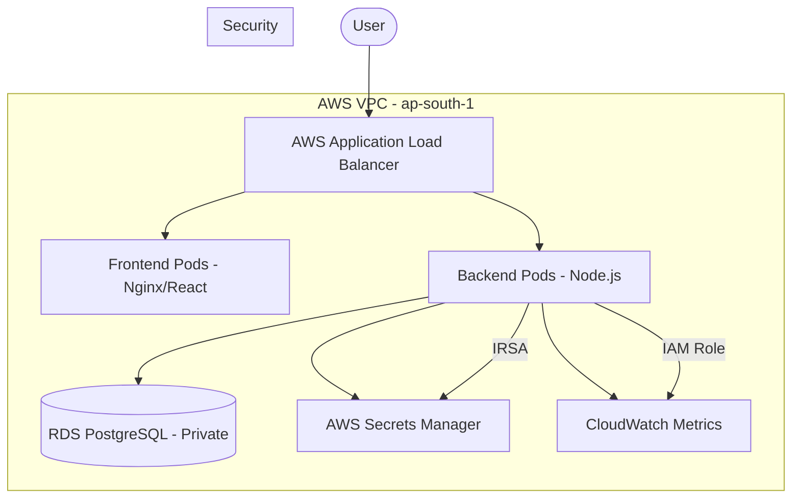

# 🚀 Alpha EKS Demo Web App

A production-grade, full-stack DevOps implementation featuring a React frontend, Node.js backend, and automated AWS infrastructure managed via Terraform.

---

## 🏗️ Architecture Overview

This project implements a robust, secure, and scalable architecture on AWS.



### 🛠️ Technology Stack
- **Frontend**: React, Vite, Nginx, Docker.
- **Backend**: Node.js, Express, PostgreSQL, AWS SDK.
- **Infrastructure**: Terraform, AWS (EKS, RDS, ECR, Secrets Manager, VPC).
- **CI/CD**: GitHub Actions.

---

## � Local Development

Get the environment running locally in seconds using Docker Compose:

```bash
# Clone the repository and run:
docker-compose up --build
```
- **Frontend**: [http://localhost:5173](http://localhost:5173)
- **Backend API**: [http://localhost:3000](http://localhost:3000)

---

## 🚀 Cloud Deployment (AWS)

### 1. Provision Infrastructure
```bash
cd terraform/environments/dev
terraform init
terraform apply -auto-approve
```

### 2. Connect to EKS
```bash
aws eks update-kubeconfig --name demo-eks --region ap-south-1
```

### 3. Deploy Application
```bash
# Build & Push images to ECR (Replace <ACCOUNT_ID>)
docker build -t <ACCOUNT_ID>.dkr.ecr.ap-south-1.amazonaws.com/demo-backend:latest ./app/backend
docker push <ACCOUNT_ID>.dkr.ecr.ap-south-1.amazonaws.com/demo-backend:latest

# Build & Push Frontend
docker build -t <ACCOUNT_ID>.dkr.ecr.ap-south-1.amazonaws.com/demo-frontend:latest ./app/frontend
docker push <ACCOUNT_ID>.dkr.ecr.ap-south-1.amazonaws.com/demo-frontend:latest

# Apply Kubernetes Manifests
kubectl apply -f k8s/
```

---

## �️ Security Architecture

### 🔐 IRSA (IAM Roles for Service Accounts)
We use a **zero-trust** approach for credentials. Instead of hardcoding keys, the backend pod uses an IAM Role (`...-backend-irsa`) to dynamically fetch database credentials from **AWS Secrets Manager** at runtime.

### 🌐 Network Isolation
- **RDS**: Placed in private subnets with no public access.
- **EKS Nodes**: Managed in private subnets, receiving traffic only via the ALB.
- **ALB**: Internet-facing, providing a single secure entry point.

---

## � Troubleshooting & Tips

- **ALB Stuck?**: Ensure your public subnets are tagged with `kubernetes.io/role/elb = 1`.
- **403 Access Denied?**: Check if the OIDC provider ID in the IAM Trust Policy matches the current cluster (`aws eks describe-cluster`).
- **RDS Connection Failed?**: Verify that the backend is fetching secrets from the correct region (`ap-south-1`).

---

## 🧹 Cleanup
To avoid AWS costs when finished:
```bash
# 1. Delete K8s resources (deletes ALB)
kubectl delete -f k8s/

# 2. Destroy Infrastructure
cd terraform/environments/dev
terraform destroy -auto-approve
```

---
*Developed as part of the Alpha EKS Demo Series.*
